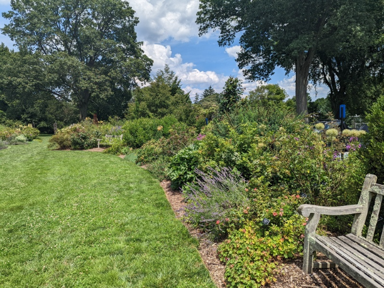
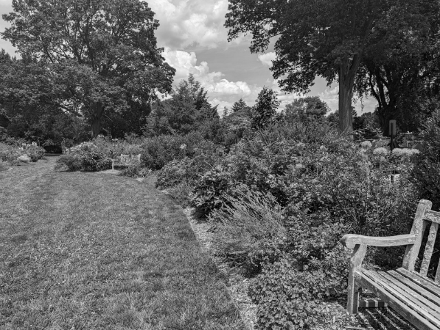
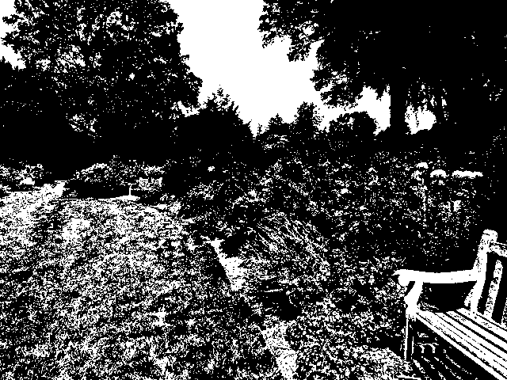
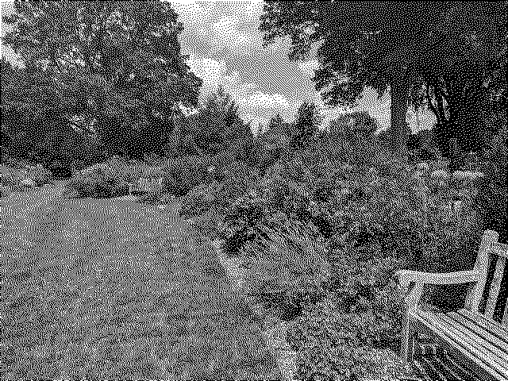

# Assignment 1: Dithering

**DUE February 5th at 11:59 PM**

In this lab, we will learn how to capture images from the webcam, work
with various [color spaces](http://www.easyrgb.com/en/math.php), and
perform thresholding and dithering of images.

**I'll show live demos of each component at the start of lab (so be on time!).**

Our first task is to create a simple [half-tone
filter](https://en.wikipedia.org/wiki/Halftone) for our webcam. Study
the following two sketches (the [reference
page](https://p5js.org/reference/) is worthy of book-marking):

   1. [Video Pixels](https://p5js.org/examples/dom-video-pixels.html)
   2. [`createCapture`](https://p5js.org/reference/#/p5/createCapture)

Create a sketch that performs the half-tone effect on a live webcam
image. You can call `capture.size(width, height)` to make sure the
sketch canvas and webcam are the same size.  Experiment with other
shapes than circles, for example, rectangles. For the rest of this
lab, we won't rely on processing drawing primitives, but instead
manipulate images pixel by pixel.

**NOTE**: A common mistake is mismatching the size of the canvas and
webcam images. Moreover, make sure you aren't using [`pixels`](https://p5js.org/reference/#/p5/pixels) when you
mean `capture.pixels`; the canvas itself has an array of pixels, in
addition to individual images.

## RGB->Gray


{width=200px} 
{width=200px}
[hsluv.org](https://www.hsluv.org/comparison/)

The next step will be to convert our color images to gray
scale. Although we can use Processing's
[`filter`](https://p5js.org/reference/#/p5/filter) function, **we will
not be using that in this lab (or hardly ever)**. Instead you will
convert each pixel from RGB to gray scale. In other words, we will go
from a color space with `256 x 256 x 256` unique colors to one with
simply 256 separate gray-scale levels.

{width=200px} 
{width=200px} 


There are a variety of ways to convert from RGB to gray scale, and
we'll talk about many during class, but for this assignment, compare
two approaches:

1. Average: just find the mean of the red, green and blue channels.
```
     function rgb2avg(r, g, b){
        return (r + g + b) / 3;
     }
```

2. Weighted Average: the average of the three channels, but count green more heavily. 

$gray = 0.3 \cdot red  + 0.59 \cdot green + 0.11 \cdot blue$

## Thresholding: Gray->Binary

The next step is to further quantize the image from 256 possible
gray values down to just 2 binary colors: black `(0,0,0)` & white
`(255, 255, 255)`. Use an arbitrary threshold (e.g., `127`) for now,
we'll cover a better way to do this in a few weeks.

{width=200px} 
{width=200px} 

## Dithering: Gray->Binary

Our final step turns our images into black and white in a more
sophisticated manner using [Floyd-Steinberg
dithering](https://en.wikipedia.org/wiki/Floyd%E2%80%93Steinberg_dithering).

{width=200px} 
{width=200px} 

## Challenge Problems

1. Convert to gray scale taking into account [gamma compression and luminance](https://en.wikipedia.org/wiki/Grayscale#Colorimetric_(perceptual_luminance-preserving)_conversion_to_grayscale).
2. Perform the dithering on the full RGB image rather than only the
gray-scale version.

## Learning Objectives

- learn how to grab images from the webcam
- process pixels with `p5.js` 
- understand different [color spaces](https://p5js.org/learn/color.html)
- threshold images
- implement dithering


## Deliverables

1. Commit the javascript `sketch.js` to the repo. Your sketch should
   use [`key`](https://p5js.org/reference/#/p5/key) to toggle between
   the different ways of viewing your webcam image. I suggest writing
   your different filters as separate functions that take a
   [p5.Image](https://p5js.org/reference/#/p5.Image) and return another.
   
     - 'h' --- half-tone
     - 'g' --- gray scale (rgb average)
     - 'w' --- gray scale (weighted average)
     - 't' --- threshold
     - 'd' --- dither

2. Write a small reflection (as a markdown document named
   `reflection.md`) about what you were able to accomplish in this
   lab. Don't forget the collaboration statement!

